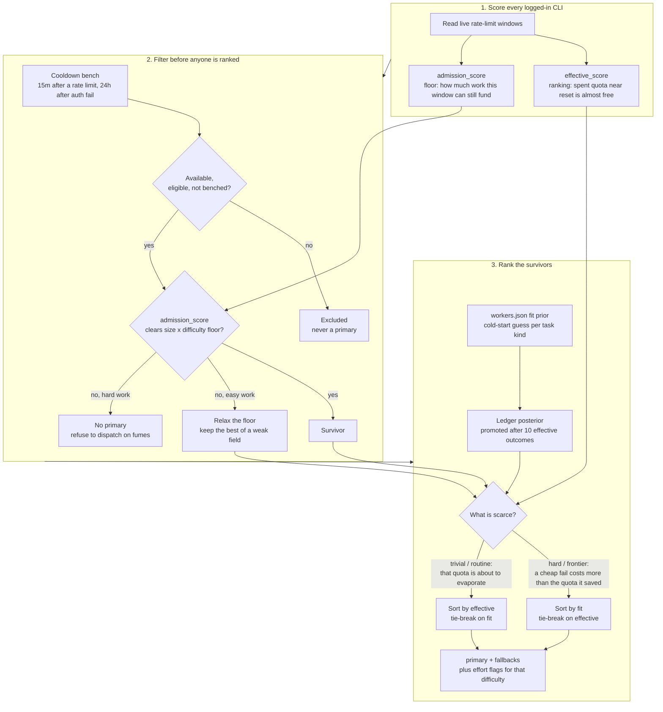

<div align="center">

# smart-subagents

**Stop burning your best model on mechanical work while a subscription you already paid for sits idle.**

Quota-aware subagent routing for [Claude Code](https://claude.com/claude-code). Reads the live rate limit on every AI coding CLI you're logged into, dispatches to the one with headroom and the right fit, isolates the work in a git worktree, and verifies the diff before it reports back.

[](LICENSE)
[](https://docs.claude.com/en/docs/claude-code/plugins)
[](#prerequisites)
[](#prerequisites)

</div>

---

## The problem

You pay for several AI coding CLIs. Each has its own rate limit, and none of them can see the
others. Claude Code can't see any of them.

So you spend your most expensive tokens on a forty-file rename, hit a wall at 4pm, and only then
remember you have a Grok subscription sitting at 100% untouched. Meanwhile the actually-hard
concurrency bug gets whatever quota happens to be left.

That's backwards on both axes: the wrong worker, and the wrong amount of thinking.

## What this does

It scores every CLI you're logged into against its live rate-limit windows, turning raw usage into
what you can actually spend now. Then it ranks the eligible ones and says who takes the task and how
hard they should think.

```console
$ ai-cli-usage.py --task-size large --difficulty hard

AI CLI usage  (2026-08-20 22:43 EEST)
================================================================

[OK] CLAUDE  plan=claude_max  score=18  eff=88  adm=54
  (LOW) 5h_session: 82% used, 18% left, resets in 0.6h, eff=88
  (OK) weekly_all: 46% used, 54% left, resets in 2.5d, eff=100, adm=54

[SKIP] CODEX  plan=plus  score=0  eff=90  adm=90
  skip: Codex rate limit exhausted
  (EXHAUSTED) primary_window: 100% used, 0% left, resets in 0.4h, eff=90

[OK] GROK  plan=SUBSCRIPTION_TIER_SUPER_GROK_PRO  score=100  eff=100  adm=100
  (OK) monthly_cli_credits: 0% used, 100% left, resets in 12.1d, eff=100

================================================================
RECOMMENDATION
  primary_worker : grok
  fallbacks      : kimi
  local_labor_ok : True
  difficulty     : hard (effort=high, floor=56.0)
  worker_args    : --reasoning-effort high
  rank_basis     : fit
  fit codex      : prior=1.05 posterior=1.02 n_eff=6.4 used=no (advisory)
  fit grok       : prior=1.00 posterior=1.08 n_eff=11.2 used=yes
  fit kimi       : prior=0.90 posterior=0.92 n_eff=2.1 used=no (advisory)
  - primary=grok (headroom=100, effective=100, admission=100, fit=1.08, ...)
  - codex: Codex rate limit exhausted
```

It then runs the job on grok at high effort in a throwaway worktree and checks the result itself.
What that check is, and what it refuses, is in [Guarantees](#guarantees).

## Two axes, not one

Most routing conflates "big" with "hard". **Size** is how much surface a task touches (`tiny`
`small` `medium` `large`) and gates the quota headroom a worker must have. **Difficulty** is how
much thinking it needs (`trivial` `routine` `hard` `frontier`) and gates its reasoning effort. A
15-line lock-free ring buffer is `small` and `hard`; a 40-file rename is `large` and `trivial`.

| Difficulty | Asks for | Quota floor | Cross-review |
|---|---|---|---|
| `trivial` | `low` | 0.6x | no |
| `routine` | `medium` | 1.0x | no |
| `hard` | `high` | 1.4x | no |
| `frontier` | `xhigh` | 1.8x | **required** |

The rung clamps to each worker's own ladder: codex clamps `xhigh` to `high`, grok takes it verbatim,
kimi has no effort flag and switches to a faster model alias. Those facts live in
[`scripts/workers.json`](scripts/workers.json), not the router.

## Routing

**Effective headroom, not percent left.** A short window's spent quota is discounted by how near its
reset is: 90% used with 24 minutes to go ranks 91, with four hours to go ranks 10. Long windows
price against pace. Pace ranks, raw remaining admits: the floor reads an `admission_score` that
never credits a window for being spent slowly, so a weekly at 93% used ranks 51 and admits 7.

**Filter, then rank.** Eligibility and the floor cut the field first, at every size. Difficulty then
picks the ranking objective: `hard` and `frontier` rank by capability fit (a cheap worker that fails
costs more than the quota it saved), `trivial` and `routine` by headroom (that quota is about to
evaporate), each the other's tie-break. Below the floor, cheap work relaxes it; hard work gets no
primary at all.

**Cooldowns are cross-task.** A failed dispatch has its log tail classified conservatively as a rate
limit, an auth failure, or nothing. On a match that worker is benched for every task: 15 minutes for
a rate limit, 24 hours for auth.

**Fit is measured, then promoted.** The registry's `fit` numbers are cold-start priors; each outcome
you record feeds an age-decayed empirical-Bayes posterior per (worker, kind) cell, advisory until
that cell has 10 effective observations and clamped to `[0.85, 1.15]`. Usage snapshots also forecast
early exhaustion, which is advisory too.



Formulas, thresholds and the ledger loop: [docs/ROUTING.md](docs/ROUTING.md).

### Planning is a panel, not a guess

Ask for a plan and you get one opinion with unknown blind spots. `plan` fans the goal out to N
planners with different lenses (`pragmatic` for the smallest correct change, `risk` for what breaks,
`architecture` for what is load-bearing, `constraints` for what the repo already decided), then has
a supervisor reconcile them. The disagreements are the value.

```bash
smart-subagents.sh plan --repo ~/code/api --n 3 --difficulty hard --goal-file goal.md
```

Planners run in parallel in one shared read-only worktree, round-robined across whichever CLIs have
quota, so a day with one eligible CLI still yields N plans instead of zero.

## Guarantees

**Isolation.** Every write goes to its own worktree on an `ssa/<id>` branch, so your checkout is
never touched, dirty or not. Kimi and Claude/Fable have no sandbox, so writes to them need
`SSA_ALLOW_UNSANDBOXED_WRITE=1` (legacy alias `SSA_ALLOW_KIMI_WRITE=1`), which the task dir timestamps.
Minting is transactional, and retiring is conservative (`cleanup` in
[Operate](#operate)).

**Verification, not trust.** Nothing the worker claims is taken on faith: `verify` scores its own
commands against a pre-dispatch baseline, so old failures are never charged to it, and writes a
`pass`/`fail`/`inconclusive` verdict. The supervisor still reads the diff itself.

**Budgets by failure class**, not a flat retry count:

| Failure | Budget |
|---|---|
| Scope violation, secrets, wrong branch, destructive | **0**, stop |
| Deterministic lint/type/build/test failure in scope | **≤3**, and each must show progress |
| Worker reports blocked, or design ambiguity | **0**, escalate |
| Rate limit or auth | switch worker with a fresh brief, never a resume |
| Missing toolchain or sandboxed network | **0**, classified `env-blocked` |

## Operate

A dispatch you cannot see, stop, or account for is not delegation, it is hope. Run `doctor` first:
it checks offline whether a dispatch could run at all here.

| Command | Does |
|---|---|
| `doctor [--json]` | offline health check: git, python3, worker binaries, credential files (existence only), cache perms, work dir, orphans, stale worktrees. Nonzero only when a dispatch could not run |
| `pick --size SIZE [--difficulty L] [--kind K]` | print the primary worker name on stdout, the full recommendation JSON on stderr |
| `ls` | one line per task and planning panel: age, repo, worker, size/difficulty/kind, inferred phase, recorded state, diff size |
| `status --dir DIR` | one task in full: base sha, branch, exit code, session or `resume=unavailable`, worker pid state, recorded state and event count, verify verdict, last log lines |
| `tail --dir DIR` | follow the worker's `stdout.log` |
| `stop --dir DIR` | TERM then KILL the worker's process group, refusing when the pid now belongs to someone else |
| `verify --dir DIR` | run the verify commands against the baseline, check scope and secrets, write `outcome.json`; exit 0 pass, 1 fail, 2 inconclusive |
| `verify-summary --dir DIR` | compact git state for the supervisor: stat and name-status only |
| `scan-secrets --dir DIR` | credential regexes plus Shannon entropy over added lines, newly added env files, and a gitleaks pass when gitleaks is installed |
| `cooldown --cli CLI [--clear]` | bench a worker across every task, or lift the bench early |
| `record --dir DIR --outcome ...` | append one line to the outcome ledger (see [Privacy](#privacy) for what is in it) |
| `ledger [--days N]` | per-CLI dispatch count, verified-pass rate, mean retries, quota consumed |
| `cleanup --dir DIR` | remove worktree, `ssa/<id>` branch and task dir, refusing while a worker is alive, the tree is dirty, or the branch holds commits the base does not have |
| `gc [--older-than DAYS]` | classify every task dir safe or kept; dry run until `--no-dry-run` |

A backgrounded worker (`dispatch --dir "$DIR" --background`) gets its own process group and a
watchdog sampling log size and a worktree fingerprint every 30s; when both go quiet for
`SSA_STALL_SECS` it kills the group and writes `stalled.txt`. The ledger is the part that compounds,
one line per run:

```console
$ smart-subagents.sh ledger --days 7
ledger: last 7d, 14 dispatch(es)
WORKER     DISPATCH  VERIFIED-PASS   MEAN RETRY   QUOTA USED %
codex             9            78%         0.44          31.2%
grok              5            60%         1.20          12.7%
```

## Install

### Prerequisites

Python 3.9+, git, bash, and at least one worker CLI you're already logged into. Nothing here handles
authentication: it reads the credentials those CLIs stored, to call each provider's usage endpoint.
The worker list, sandboxes and binary lookup live in [`scripts/workers.json`](scripts/workers.json),
not in a table here, and `doctor` prints it with what is installed.

As a Claude Code plugin:

```
/plugin marketplace add m-esm/smart-subagents
/plugin install smart-subagents@smart-subagents
```

Or clone it, symlinking both entry points so the examples here run as written (drop the last line
and call `python3 scripts/ai-cli-usage.py` instead):

```bash
git clone https://github.com/m-esm/smart-subagents.git
ln -s "$PWD/smart-subagents/agents/smart-subagents.md" ~/.claude/agents/
ln -s "$PWD/smart-subagents/scripts/smart-subagents.sh" /usr/local/bin/
ln -s "$PWD/smart-subagents/scripts/ai-cli-usage.py" /usr/local/bin/
```

**Upgrade.** Plugin users re-run the marketplace install or update from the `/plugin` menu; clone
users `git pull`. The version is in [`.claude-plugin/plugin.json`](.claude-plugin/plugin.json),
changes in [CHANGELOG.md](CHANGELOG.md).

### Quickstart

A **brief** is a markdown file the worker reads instead of a chat: goal, absolute workdir, in scope,
out of scope, constraints, acceptance criteria, and the exact self-verify commands with their
success signal, plus **Structural discovery** (`CGC:` pack path or `CGC-SKIP`),
templated in [`agents/smart-subagents.md`](agents/smart-subagents.md). The
**supervisor** is whoever minted the task, your session or an agent acting for it, not a daemon.

```bash
# Mint a task: private dir, isolated worktree, worker pick, one call.
DIR=$(smart-subagents.sh init --repo ~/code/api --size medium --difficulty hard \
  | python3 -c 'import json,sys; print(json.load(sys.stdin)["dir"])')
# Write the brief. The worktree is $DIR/wt; that is the workdir it names.
$EDITOR "$DIR/brief.md"
# Run it, check it, then log the line that improves the next pick.
smart-subagents.sh dispatch --dir "$DIR"
smart-subagents.sh verify   --dir "$DIR"
smart-subagents.sh record   --dir "$DIR" --outcome verified-pass --retries 0
```

If `init` picked kimi or claude and the task writes files, `dispatch` refuses until you set
`SSA_ALLOW_UNSANDBOXED_WRITE=1` on purpose (`SSA_ALLOW_KIMI_WRITE=1` still works). From Claude Code, handing that brief to the `smart-subagents`
agent runs this loop for you.

## Configuration

| Variable | Default | Purpose |
|---|---|---|
| `SSA_WORK_DIR` | `$TMPDIR/smart-subagents` | Task scratch root |
| `SSA_WORKERS_JSON` | `scripts/workers.json` | Alternative worker registry |
| `SSA_USAGE_PY` / `SSA_CLI_PY` | alongside the script | Paths to `ai-cli-usage.py` and `ssa/cli.py` |
| `SSA_ALLOW_UNSANDBOXED_WRITE` | unset | Accept a write dispatch to a worker with no sandbox (claude, kimi) |
| `SSA_ALLOW_KIMI_WRITE` | unset | Legacy alias for `SSA_ALLOW_UNSANDBOXED_WRITE` |
| `SSA_PREMIUM_MODELS` | `Fable,Opus` | Claude's usage API reports weekly caps scoped to individual models by display name. These are the ones that flip `local_labor_ok` false near their cap, so the supervisor stops doing labor in-session while cheaper models are still fine. Set it to whatever your plan's premium tier is actually called |
| `SSA_SHORT_HORIZON_HOURS` | `4` | Reset horizon over which a short window's spent quota stops counting against it |
| `SSA_FIT_HALFLIFE_DAYS` | `30` | Half-life on ledger evidence feeding the learned fit posterior |
| `SSA_FIT_MIN_SAMPLES` | `10` | Effective observations before a posterior ranks instead of the prior |
| `SSA_STALL_SECS` | `600` | Watchdog patience before it kills a silent background worker |
| `SSA_KILL_GRACE_SECS` | `10` | Seconds between TERM and KILL when stopping a worker |
| `SSA_DEADLINE_SECS` | off | Absolute ceiling on a background run |
| `SSA_LEDGER` | `$XDG_STATE_HOME/smart-subagents/outcomes.jsonl` | Outcome ledger path |
| `SSA_NO_QUOTA_SNAPSHOT` | unset | Skip the post-dispatch quota snapshot (offline machines, tests) |
| `CODEX_BIN` / `GROK_BIN` / `KIMI_BIN` / `CLAUDE_BIN` | auto-detected | Override worker binary paths. The variable name per worker comes from its registry entry, so a new worker declares its own |

## Architecture

`scripts/smart-subagents.sh` is the launcher: it owns the task lifecycle and knows nothing about any
particular CLI. `scripts/ssa/` is the runtime it calls (Python 3.9, stdlib only): `registry.py`
validates, `adapters.py` builds commands and scrapes session ids, `state.py` holds the transition
table, `cli.py` is the seam. `scripts/workers.json` is the only place a CLI's name, flags, sandbox,
effort ladder or session format appears. Every task dir carries a `task.json` and an append-only
`events.jsonl`, and every dispatch adds a line to `outcomes.jsonl`, which routing learns from. Full
map, lifecycle machine, adding a worker: [docs/ARCHITECTURE.md](docs/ARCHITECTURE.md).

## Develop

`bash tests/run.sh` runs `tests/smoke.sh` then the Python suite via `unittest discover`, hermetic
and stdlib-only: no network, no credentials, no worker CLI runs. `tests/fixtures/` holds synthetic
provider payloads for each probe's pure `parse_*_usage` half, plus fake worker binaries whose argv
`test_shell.py` asserts exactly. That assertion is the adapter contract: update it on purpose.

## Privacy

Credentials are read locally to call each provider's usage endpoint. No token is ever printed,
logged, or transmitted anywhere else. Account emails are **redacted by default in every output
path**, including `--json` and the cache; pass `--include-account` if you want them. The cache is
mode 0600 inside a 0700 `$XDG_CACHE_HOME/smart-subagents/`, and task dirs (brief, worker logs, a
full worktree of your source) are mode 0700 under `$TMPDIR`.

The outcome ledger at `$XDG_STATE_HOME/smart-subagents/outcomes.jsonl` (0600) is deliberately thin:
worker, task class, effort flags, exit code, wall time, diff counts, verification verdict, quota
deltas, and a hash of the repo path. No prompt text, no diff, no filename, no session id, no
account identifier.

## Known gaps

- **Cold-start fit is guesswork.** Hand-tuned priors stay in charge until a (worker, kind) cell
  reaches 10 effective observations, which rarely-dispatched kinds may never hit. The reward is a
  proxy: pass plus retry count cannot see a diff that passed the tests and was the wrong design.
- **Kimi and Claude/Fable have no sandbox** and are write-blocked by default. A worktree does not contain a worker's
  access to the rest of your system.
- **Difficulty picks effort, not models.** It selects a model only where the registry carries a rule.
  Claude always pins `--model fable`. Kimi may switch to a faster alias. Codex/Grok model names are
  account-scoped and this repo will not invent them.
- **No conversation transfer.** Cross-CLI handoff starts from a fresh brief plus the current diff,
  because no CLI here can import another's session.

## License

MIT. See [LICENSE](LICENSE).
