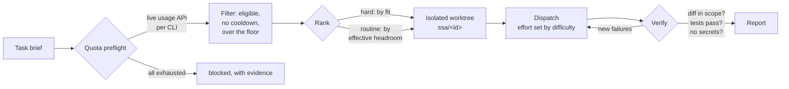

<div align="center">

# smart-subagents

**Stop burning your best model on mechanical work while a subscription you already paid for sits idle.**

Quota-aware subagent routing for [Claude Code](https://claude.com/claude-code). Reads the live rate limit on every AI coding CLI you're logged into, dispatches to the one with headroom and the right fit, isolates the work in a git worktree, and verifies the diff before it reports back.

[](LICENSE)
[](https://docs.claude.com/en/docs/claude-code/plugins)
[](#requirements)
[](#requirements)

</div>

---

## The problem

You pay for several AI coding CLIs. Each has its own rate limit, and none of them
can see the others. Claude Code can't see any of them.

So you spend your most expensive tokens on a forty-file rename, hit a wall at
4pm, and only then remember you have a Grok subscription sitting at 100%
untouched. Meanwhile the actually-hard concurrency bug gets whatever quota
happens to be left.

That's backwards on both axes: the wrong worker, and the wrong amount of thinking.

## What this does

```console
$ ai-cli-usage.py --task-size large --difficulty hard

AI CLI usage  (2026-08-20 22:43 EEST)
================================================================

[OK] CLAUDE  plan=claude_max  score=18  eff=88  adm=54
  (LOW) 5h_session: 82% used, 18% left, resets in 0.6h, eff=88
  (OK) weekly_all: 46% used, 54% left, resets in 2.5d, eff=100, adm=54

[SKIP] CODEX  plan=plus  score=0  eff=90  adm=90
  skip: Codex rate limit exhausted
  (EXHAUSTED) primary_window: 100% used, 0% left, resets in 0.4h, eff=90

[OK] GROK  plan=SUBSCRIPTION_TIER_SUPER_GROK_PRO  score=100  eff=100  adm=100
  (OK) monthly_cli_credits: 0% used, 100% left, resets in 12.1d, eff=100

================================================================
RECOMMENDATION
  primary_worker : grok
  fallbacks      : kimi
  local_labor_ok : True
  difficulty     : hard (effort=high, floor=56.0)
  worker_args    : --reasoning-effort high
  rank_basis     : fit
  fit codex      : prior=1.05 posterior=1.02 n_eff=6.4 used=no (advisory)
  fit grok       : prior=1.00 posterior=1.08 n_eff=11.2 used=yes
  fit kimi       : prior=0.90 posterior=0.92 n_eff=2.1 used=no (advisory)
  - primary=grok (headroom=100, effective=100, admission=100, fit=1.08, ...)
  - codex: Codex rate limit exhausted
```

Then it runs the job on grok at high reasoning effort, in a throwaway worktree,
and checks the result itself.



## Two axes, not one

Most routing conflates "big" with "hard". They're independent, and treating them
as one is why easy work gets expensive models and subtle work gets rushed.

|  | **Size** = how much surface it touches | **Difficulty** = how much thinking it needs |
|---|---|---|
| **Controls** | how much quota headroom a worker must have | which reasoning effort the worker runs at |
| **Levels** | `tiny` `small` `medium` `large` | `trivial` `routine` `hard` `frontier` |
| **Example A** | a 15-line lock-free ring buffer is `small` | ...and `hard` |
| **Example B** | a 40-file mechanical rename is `large` | ...and `trivial` |

Difficulty maps to whatever knob each CLI actually exposes, clamped to what that
CLI supports:

| Difficulty | codex | grok | kimi | Quota floor | Cross-review |
|---|---|---|---|---|---|
| `trivial` | `model_reasoning_effort=low` | `--reasoning-effort low` | `-m kimi-for-coding-highspeed` | 0.6x | no |
| `routine` | `=medium` | `medium` | default | 1.0x | no |
| `hard` | `=high` | `high` | default | 1.4x | no |
| `frontier` | `=high` | `xhigh` | default | 1.8x | **required** |

Harder work gets a higher quota floor on purpose: retries are likelier and each
turn costs more. For `hard` and `frontier`, if no worker meets the floor, the
router returns no primary worker and does not dispatch on fumes. `trivial` and
`routine` keep the best eligible worker as a fallback when all are below it.

## What the router actually optimizes

Subscription quota costs nothing at the margin and is worth nothing at reset.
Hoarding it is not a strategy. The two things that are genuinely scarce are
quality on hard work, and the best worker's headroom when the next hard task
arrives. Routing is built around those, not around "percent left".

### Effective headroom, not percent left

Raw `used_pct` still drives every severity label and every exhaustion gate.
Ranking uses a corrected number instead:

| Window | Correction | Why |
|---|---|---|
| Short (period ≤ 6h) | `100 - used * min(1, resets_in_hours / 4)` | Quota that comes back in minutes is nearly free |
| Long (weekly, monthly) | `100 - max(0, used - pace)`, where `pace = 100 * elapsed / period` | Only being **ahead** of pace is a cost; being behind is not a bonus |
| Period unknown | raw `remaining_pct`, marked `forecast_basis: "raw"` | Never invent a period the provider did not report |

A 5h window at 90% that resets in 24 minutes scores **91**, not 10. That is the
correct answer: you are about to get all of it back, so spending the rest of it
now is close to free. The same 90% with four hours still to run scores 10.

Each CLI's `effective_score` is the worst of its binding windows, and every
window carries its own `effective` in `--json` and an `eff=` on the human line.
The reset horizon is tunable with `SSA_SHORT_HORIZON_HOURS`.

Pace ranks; it does not admit. Being behind pace on a weekly window means you
spent it slowly, not that there is more of it, so the quota floor reads
`admission_score` instead: raw remaining on long windows, and the discounted
value only on a short window whose reset is close enough to refill it before the
run can spend what is left. A weekly window at 93% used ranks like a 51 and
admits like a 7, which is what it is.

### Filter, then rank

The quota floor is a filter at **every** size, checked against `admission_score`.
Ranking is a separate step on `effective_score`, and what it ranks by depends on
difficulty:

| Difficulty | Ranks by | Tie-break | Reason |
|---|---|---|---|
| `hard`, `frontier` | capability fit | effective headroom | A cheap worker that fails costs more than the quota it saved |
| `trivial`, `routine` | effective headroom | fit | Spend the quota that is about to evaporate |

There is no headroom-times-fit product any more. A product lets a large headroom
number drown a real capability gap on exactly the tasks where the gap matters. A
CLI named with `--prefer` wins outright when it survives the filter, with no
thumb on the scale.

### Cooldowns are cross-task

A 429 is not one task's problem. When a dispatch fails, the tail of the worker
log is classified conservatively: rate limit, auth failure, or nothing. On a
match the worker is benched for every task until the cooldown expires, 15
minutes for a rate limit and 24 hours for auth, never open-ended.

```bash
smart-subagents.sh cooldown --cli codex --reason rate-limit   # manual bench
smart-subagents.sh cooldown --cli codex --clear               # lift it early
```

The state lives in `$XDG_STATE_HOME/smart-subagents/cooldowns.json`, so a
cooldown one task discovered is honored by the next one. Benched workers show
up in the human table and in `recommendation.reasons`.

### Fit is measured, then promoted

`FIT` is a cold-start prior now, not the final word. Every recorded outcome
updates a posterior per (worker, kind) cell: empirical Bayes with 8
pseudo-observations behind the prior, a 30-day half-life on old evidence, and
shrinkage toward the worker's own cross-kind average while a cell is thin.
Rewards come from the ledger, 1.0 for a verified pass in at most one retry, 0.5
for a messier pass or a partial, 0.0 for a rejection. Blocked, env-blocked and
rate-limited runs say nothing about capability, so they are excluded.

The posterior only takes over once a cell has 10 effective observations
(`SSA_FIT_MIN_SAMPLES`), and it is clamped to `[0.85, 1.15]` either way. Until
then it is advisory and visible: `recommendation.fit` always carries `prior`,
`posterior`, `n_eff` and `used` per CLI. A bad streak cannot retire a worker,
and a corrupt ledger line is skipped and counted, never fatal.

### Burn rate is advisory

Every fresh fetch appends one line per window to
`$XDG_STATE_HOME/smart-subagents/usage-history.jsonl`, compacted to 7 days. From
the last 6 hours of snapshots the router takes a robust slope (median of pairwise
slopes, ignoring any pair that straddles a reset) and projects when the window
would exhaust. When that is sooner than the reset, you get a line like:

```
- advisory: codex primary_window exhausts in ~2h at current burn
```

It changes no gate and never flips `local_labor_ok`. Three snapshots and a
positive slope is a hint about what to start now, not a measurement to route on.

## Planning is a panel, not a guess

Ask for a plan and you get one opinion with unknown blind spots. This fans the
goal out to several planners with deliberately different lenses, then makes a
supervisor reconcile them.

```bash
smart-subagents.sh plan --repo ~/code/api --n 3 --difficulty hard \
  --goal "Move auth middleware from Express to NestJS guards"
```

| Lens | Asks |
|---|---|
| `pragmatic` | smallest correct change that ships; what in the goal is scope creep |
| `risk` | what breaks, what has no coverage, what's hard to roll back |
| `architecture` | what's load-bearing, which refactor pays for itself, what to leave alone |
| `constraints` | what the repo already decided; the conventions to plan within |

Planners run in parallel in one shared read-only worktree and round-robin across
whichever CLIs have quota, so a day when only one CLI is eligible still gets you
N independent plans instead of zero. The supervisor then reads all of them,
resolves the disagreements by reading the code, and emits a single plan.

The disagreements are the value. In a live run on this repo, the pragmatic
planner argued against extracting a shared command builder as needless surface,
while the risk planner argued the opposite and caught that a naive implementation
would still charge quota on a dry run. Neither plan alone was right.

## Guarantees

**Isolation.** Every write goes to its own worktree on an `ssa/<id>` branch. Your
checkout is never touched, dirty or not. Kimi has no sandbox. Write dispatches
to kimi are blocked by default because a worktree does not contain its access
to your system. Set `SSA_ALLOW_KIMI_WRITE=1` to accept that risk for one
dispatch. The task directory records the override timestamp.

Minting a task is transactional. If anything fails after the worktree exists,
the worktree and its `ssa/<id>` branch are rolled back rather than left behind.
Retiring one is conservative: `cleanup` refuses while a worker is alive, the
worktree is dirty, or the branch holds commits the base does not have.

**Verification, not trust.** `verify` runs the task's own verify commands,
compares every exit code against the pre-dispatch baseline so old failures are
never charged to the worker, checks that each changed path matches a declared
scope glob, runs the secret scan, and writes a machine-readable `outcome.json`
with a `pass` / `fail` / `inconclusive` verdict. `scan-secrets` checks added
lines with built-in credential regexes and Shannon entropy detection, rejects
newly added `.env` files, and adds a gitleaks pass when gitleaks is installed.
The supervisor still reads the diff against the recorded base SHA itself.

**Budgets by failure class**, not a flat retry count:

| Failure | Budget |
|---|---|
| Scope violation, secrets, wrong branch, destructive | **0**, stop |
| Deterministic lint/type/build/test failure in scope | **≤3**, and each must show progress |
| Worker reports blocked, or design ambiguity | **0**, escalate |
| Rate limit or auth | switch worker with a fresh brief, never a resume |
| Missing toolchain or sandboxed network | **0**, classified `env-blocked` |

## Requirements

Python 3.9+, git, bash, and at least one worker CLI you're already logged into:

| Worker | CLI | Write sandbox |
|---|---|---|
| codex | [OpenAI Codex CLI](https://github.com/openai/codex) | `-s workspace-write` |
| grok | Grok CLI | always `--sandbox workspace` |
| kimi | Kimi Code | none, write dispatch blocked unless `SSA_ALLOW_KIMI_WRITE=1` |

Nothing here handles authentication. It reads whatever credentials those CLIs
already stored, to call each provider's own usage endpoint.

## Install

As a Claude Code plugin:

```
/plugin marketplace add m-esm/smart-subagents
/plugin install smart-subagents@smart-subagents
```

Or clone it:

```bash
git clone https://github.com/m-esm/smart-subagents.git
ln -s "$PWD/smart-subagents/agents/smart-subagents.md" ~/.claude/agents/
ln -s "$PWD/smart-subagents/scripts/smart-subagents.sh" /usr/local/bin/
```

## Use

From Claude Code, hand the agent a task. It refuses to guess at any of the four
things it needs, so include them:

> Use the smart-subagents agent to port the auth middleware in `~/code/api` from
> Express to NestJS guards. In scope: `src/auth/**`. Out of scope: the lockfile
> and any public route signatures. Acceptance: `npm test` passes and
> `npm run build` succeeds.

Standalone:

```bash
# Who should take this, and how hard should they think?
ai-cli-usage.py --recommend --task-size medium --difficulty routine

# Everything, machine-readable
ai-cli-usage.py --json --task-size large --difficulty frontier

# Mint a task: private dir + isolated worktree + worker pick, one call
smart-subagents.sh init --repo ~/code/api --size medium --difficulty hard

# Write $DIR/brief.md, then
smart-subagents.sh dispatch --dir "$DIR"
smart-subagents.sh verify --dir "$DIR"

# Or plan first
smart-subagents.sh plan --repo ~/code/api --n 3 --goal-file goal.md
```

### Operate

A dispatch you cannot see, stop, or account for is not delegation, it is hope.

```bash
smart-subagents.sh dispatch --dir "$DIR" --background   # detach, watchdog armed
```

| Command | Does |
|---|---|
| `ls` | one line per task and planning panel: age, repo, worker, size/difficulty/kind, inferred phase, diff size |
| `status --dir DIR` | one task in full: base sha, branch, exit code, session or `resume=unavailable`, worker pid state, verify verdict, last log lines |
| `tail --dir DIR` | follow the worker's `stdout.log` |
| `stop --dir DIR` | TERM then KILL the worker's process group, refusing when the pid now belongs to someone else |
| `verify --dir DIR` | run the verify commands, diff them against the baseline, check scope globs and secrets, write `outcome.json`; exit 0 pass, 1 fail, 2 inconclusive |
| `cooldown --cli CLI [--clear]` | bench a worker across every task, or lift the bench early; `dispatch` sets one itself on a rate limit or auth failure |
| `record --dir DIR --outcome ...` | append one line to the outcome ledger, no prompts, diffs, paths or session ids in it |
| `ledger [--days N]` | per-CLI dispatch count, verified-pass rate, mean retries, quota consumed |
| `cleanup --dir DIR` | remove worktree, `ssa/<id>` branch and task dir, refusing while dirty, unmerged, or running |
| `gc [--older-than DAYS]` | classify every task dir safe or kept; dry run until `--no-dry-run` |
| `doctor [--json]` | offline health check: git, python3, worker binaries, credential files (existence only), cache perms, work dir, orphans, stale worktrees |

A backgrounded worker gets its own process group and a watchdog that samples the
log size and a worktree fingerprint every 30s. When both stop moving for 600s
(`SSA_STALL_SECS`) it kills the group and writes `stalled.txt`, so a worker that
quietly wedged does not sit there until you notice.

The ledger is the part that compounds. Every run appends worker, kind, size,
difficulty, effort flags, exit code, wall time, diff size, verification verdict
and the quota it burned, keyed by a hash of the repo path rather than the path:

```console
$ smart-subagents.sh ledger --days 7
ledger: last 7d, 14 dispatch(es)
WORKER     DISPATCH  VERIFIED-PASS   MEAN RETRY   QUOTA USED %
codex             9            78%         0.44          31.2%
grok              5            60%         1.20          12.7%
```

## Configuration

| Variable | Default | Purpose |
|---|---|---|
| `SSA_WORK_DIR` | `$TMPDIR/smart-subagents` | Task scratch root |
| `SSA_USAGE_PY` | alongside the script | Path to `ai-cli-usage.py` |
| `SSA_PREMIUM_MODELS` | `Fable,Opus` | Model-scoped weekly windows that gate whether your local session should do labor itself |
| `SSA_SHORT_HORIZON_HOURS` | `4` | Reset horizon over which a short window's spent quota stops counting against it |
| `SSA_FIT_HALFLIFE_DAYS` | `30` | Half-life on ledger evidence feeding the learned fit posterior |
| `SSA_FIT_MIN_SAMPLES` | `10` | Effective observations before a posterior is used for ranking instead of the prior |
| `SSA_STALL_SECS` | `600` | Watchdog patience before it kills a silent background worker |
| `SSA_DEADLINE_SECS` | off | Absolute ceiling on a background run |
| `SSA_LEDGER` | `$XDG_STATE_HOME/smart-subagents/outcomes.jsonl` | Outcome ledger path |
| `SSA_NO_QUOTA_SNAPSHOT` | unset | Skip the post-dispatch quota snapshot (offline machines, tests) |
| `CODEX_BIN` / `GROK_BIN` / `KIMI_BIN` | auto-detected | Override worker binary paths |

`SSA_PREMIUM_MODELS` is the one worth setting. Claude's usage API reports weekly
caps scoped to individual models by display name. When your top tier is near its
cap, `local_labor_ok` flips false and the supervisor stops doing work in-session
even though cheaper models are still fine. Set it to whatever your plan's premium
tier is actually called.

## Privacy

Credentials are read locally to call each provider's usage endpoint. No token is
ever printed, logged, or transmitted anywhere else.

Account emails are **redacted by default in every output path**, including
`--json` and the on-disk cache (`mo***@gmail.com`). Pass `--include-account` if
you actually want them. The cache lives in `$XDG_CACHE_HOME/smart-subagents/`,
mode 0600 inside a 0700 directory, never in world-readable `/tmp`.

Task directories hold your brief, your worker logs, and a full worktree of your
source, so they're created mode 0700 under `$TMPDIR`. Override with
`SSA_WORK_DIR`.

The outcome ledger is deliberately thin: worker, task class, effort flags, exit
code, wall time, diff counts, verification verdict, quota deltas, and a hash of
the repo path. No prompt text, no diff, no filename, no session id, no account
identifier. It lives at `$XDG_STATE_HOME/smart-subagents/outcomes.jsonl`, mode
0600 in a 0700 directory.

## Known gaps

The `FIT` table is now the cold-start prior of a measured posterior, so a fresh
install still routes on hand-tuned constants and stays there until a
(worker, kind) cell reaches 10 effective observations. Kinds you rarely dispatch
may never get there. The reward function is a guess too: it reads verified-pass,
retry count and partial as a proxy for quality, which cannot see a diff that
passed the tests and was still the wrong design.

The clamp to `[0.85, 1.15]` is deliberate and unmeasured. It bounds how much
evidence is allowed to move a pick, which also bounds how fast the router can
learn something true.

The burn-rate forecast is a robust slope over at least three snapshots in six
hours. That is enough to notice a fast burn and not enough to trust a number.
It stays advisory for that reason.

Difficulty sets reasoning effort, not model choice, for codex and grok. Only kimi
switches models, because it's the only one of the three without an effort flag.

Cross-CLI handoff always starts from a fresh brief plus the current diff. There's
no conversation transfer, because none of these CLIs can import another's session.

## License

MIT. See [LICENSE](LICENSE).
