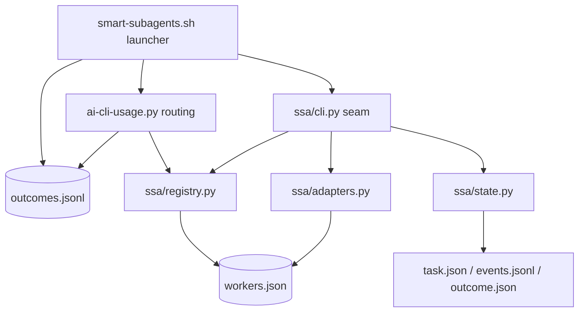
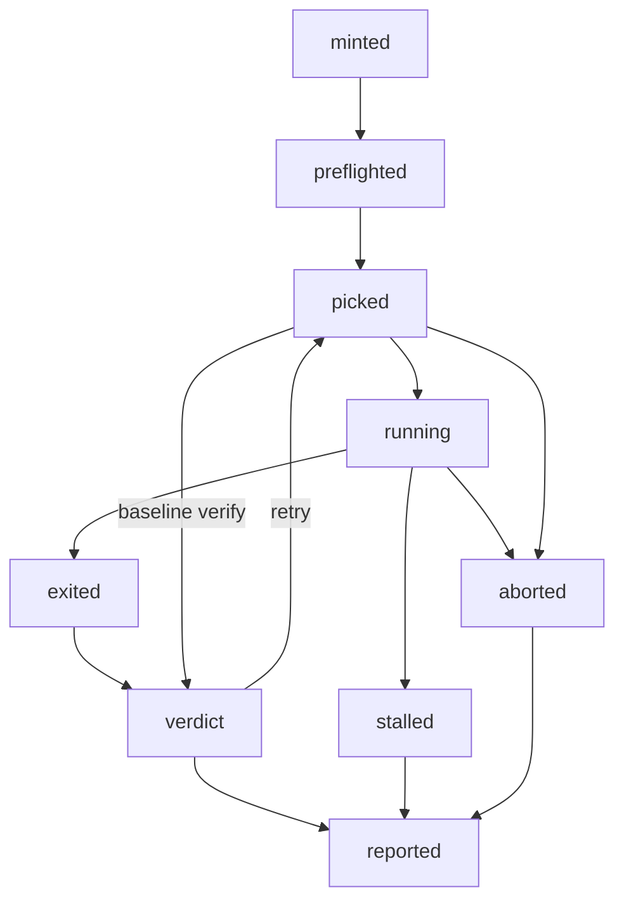

# Architecture

Four pieces, one direction of dependency. The shell launches and owns the task
lifecycle; it knows nothing about any particular CLI. Everything a CLI-specific
answer depends on comes out of the registry.



`scripts/ssa/` is the runtime: Python 3.9, stdlib only, no third-party imports.
`scripts/ai-cli-usage.py` is routing, and it reads the registry for who the
workers are, their effort ladders, their fit priors and their probe names. The
routing rules themselves are in [ROUTING.md](ROUTING.md).

## The registry

[`scripts/workers.json`](../scripts/workers.json) is the single source of
per-CLI knowledge:

- binary discovery: env var, candidate paths, PATH name
- which quota probe reports on it, by function name
- sandbox capability and whether writes are allowed by default
- how a prompt reaches it: `stdin`, `arg`, or `file-ref` with a template
- the argv template for each mode: `implement`, `plan`, `resume`
- output handling and log format per mode
- how a session id is scraped back out of the log
- the effort ladder and the flag shape that realizes a rung
- model rules per difficulty and size
- capability priors per task kind

Argv templates are arrays of tokens, never strings. The allowed placeholders are
`{worktree} {brief} {output} {session_id} {prompt} {effort} {model}`. `{effort}`
and `{model}` splice zero or more tokens; the rest are single values. A template
naming anything else, or carrying a shell metacharacter, is rejected at load
time. The argv goes to `execve`, never through a shell.

`ssa/cli.py workers` prints one row per registered worker, seven tab-separated
fields: name, display name, sandbox, write policy, probe function, resolved
binary, resolved credential file. A field the registry cannot resolve on this
machine prints as `-`.

```console
$ python3 scripts/ssa/cli.py workers
codex	OpenAI Codex CLI	os	write	check_codex	/Users/you/.local/bin/codex	/Users/you/.codex/auth.json
grok	Grok CLI	workspace	write	check_grok	/Users/you/.grok/bin/grok	/Users/you/.grok/auth.json
kimi	Kimi Code	none	no-write	check_kimi	/Users/you/.kimi-code/bin/kimi	/Users/you/.kimi-code/credentials/kimi-code.json
```

`--json` gives the same rows as objects. `no-write` means exactly what it says:
kimi has no sandbox, so a write dispatch is refused unless
`SSA_ALLOW_KIMI_WRITE=1` accepts that risk for one dispatch. `doctor` reports
the same rows with whether each binary and credential file is actually there.

## The task record

Task state is data, not inference. Every task dir carries a `task.json` (schema
version, task id, repo, base sha, worker, class, state, attempts) and an
append-only `events.jsonl` with a monotonic `seq`. Writes are atomic and
serialized by a per-task lock built on `mkdir`, so an interrupted write leaves
the previous record intact.

The lifecycle is an explicit transition table in
[`scripts/ssa/state.py`](../scripts/ssa/state.py). Illegal transitions raise.



The chart is the happy path plus the three exits you will actually hit.
`aborted` is also reachable from `minted` and `preflighted`; those edges are
omitted so the line stays readable. The rest that the picture compresses:

- `picked` can reach a verdict without any worker acting. That edge is the
  **baseline verify**: the supervisor runs the task's own verify commands
  against the untouched tree so pre-existing failures are never charged to the
  worker.
- `verdict` is three states (`verified`, `failed`, `inconclusive`). They can
  revisit each other and can go back to `picked`. Verify runs again after a
  retry, and the second answer is allowed to differ from the first.
- `reported` is reachable from `exited`, `aborted` and `stalled`. Bookkeeping is
  not work: an env-blocked or stalled dispatch still owes the ledger a line, and
  losing those lines would quietly bias the learned fit.

`reported` is the only terminal state. `status` shows both the recorded `state`
and the `phase` inferred from which artifacts exist on disk: they disagree
exactly when something went wrong, which is the point. The full table, including
the `aborted` edge out of every early state, is `TRANSITIONS` in `state.py`.

## Adding a worker

A fourth worker is a registry entry plus a probe. Two files, no new code paths.

**1. Add an entry to `scripts/workers.json`.** The minimum:

```json
"acme": {
  "display_name": "Acme Code",
  "binary": {"env": "ACME_BIN", "candidates": ["~/.acme/bin/acme"], "path_name": "acme"},
  "auth_file": "~/.acme/auth.json",
  "probe": "check_acme",
  "sandbox": "workspace",
  "write_allowed_default": true,
  "run": {"cwd": "inherit", "env_scrub": false},
  "prompt": {"implement": {"transport": "arg"}, "plan": {"transport": "arg"}},
  "argv": {
    "implement": ["run", "--cwd", "{worktree}", "-p", "{prompt}", "{effort}"],
    "plan": ["run", "--read-only", "--cwd", "{worktree}", "-p", "{prompt}", "{effort}"]
  },
  "output": {"implement": "none", "plan": "stdout"},
  "session": {"kind": "json-keys", "keys": ["session_id"]},
  "effort_ladder": ["low", "medium", "high"],
  "effort_flags": ["--effort", "{effort}"],
  "models": {"flag": ["-m", "{model}"], "rules": []},
  "fit": {"default": 1.0}
}
```

`sandbox` and `write_allowed_default` are the pair that decides whether a write
dispatch is allowed at all. `effort_ladder` is weakest rung first; a difficulty
asking for a rung above the ladder's top clamps down to it, and an empty ladder
means the worker has no effort knob, so `models.rules` is the only lever
difficulty can pull for it. `fit` keys are task kinds, and a kind the entry says
nothing about defaults to a neutral 1.0.

**2. Add a probe** to `scripts/ai-cli-usage.py`: a `check_acme()` returning a
`CliStatus`, registered in the `PROBES` table under the name the entry gives.
Until that exists the worker is listed but reported unavailable with
`skip_reason: "no quota probe"`. It is never handed invented headroom, because a
worker nobody can meter is exactly the one you must not route real work to.

**3. Check your work.**

```bash
python3 scripts/ssa/cli.py registry-validate
python3 scripts/ssa/cli.py workers
python3 scripts/ssa/cli.py build-command --worker acme --mode implement \
  --worktree /tmp/wt --brief /tmp/brief.md --effort high
```

`build-command` prints the exact argv, cwd and env policy that a dispatch would
use, without running anything:

```console
$ python3 scripts/ssa/cli.py build-command --worker kimi --mode implement \
    --worktree "$WT" --brief "$DIR/brief.md" --model kimi-for-coding-highspeed
{"argv": ["-p", "Read the file ...", "--output-format", "stream-json",
          "-m", "kimi-for-coding-highspeed"], "cwd": "...", "env_scrub": true, ...}
```

`tests/test_registry.py` is the conformance test for the claim above: it
registers a fourth worker through `SSA_WORKERS_JSON` alone and asserts that
validate, list, route, dispatch, plan and record all carry it, without editing a
line of Python. If adding a worker ever requires a code change, that suite is
what fails. It also pins the guarantees underneath: templates with unknown
placeholders or shell metacharacters are refused, illegal lifecycle transitions
raise, event sequence numbers are monotonic, and an interrupted `task.json`
write leaves the previous record intact.
