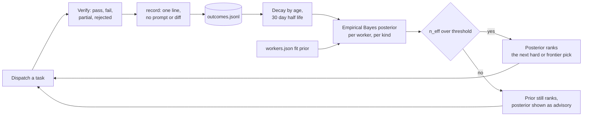

# Routing

What the router optimizes, with the formulas and thresholds it actually uses.
Everything here lives in [`scripts/ai-cli-usage.py`](../scripts/ai-cli-usage.py);
when a number below disagrees with that file, the file wins and this page is a
bug.

Subscription quota costs nothing at the margin and is worth nothing at reset.
Hoarding it is not a strategy. The two things that are genuinely scarce are
quality on hard work, and the best worker's headroom when the next hard task
arrives. Routing is built around those, not around "percent left".

## Two scores per window

Every window a provider reports gets two numbers, both on 0 to 100. Ranking
reads one, the quota floor reads the other. Raw `used_pct` still drives every
severity label and every exhaustion gate, untouched by either.

`effective_score(window)` is the ranking key:

| Case | Value | Basis |
|---|---|---|
| Short window (`period_seconds` ≤ 6h), reset known | `100 - used * min(1, resets_in_hours / H)` | `short` |
| Long window with a known period | `100 - max(0, used - pace)` | `pace` |
| Period unknown, or short window with no reset time | `100 - used` | `raw` |
| `used_pct` missing | `remaining_pct`, or `50` if that is missing too | `raw` |

`H` is `SSA_SHORT_HORIZON_HOURS`, default 4. `pace` is
`100 * elapsed / period`, clamped to 0 to 100, where
`elapsed = period - resets_in_hours * 3600`. Only being **ahead** of pace is a
cost. Being behind it is not a bonus.

A 5h window at 90% used that resets in 24 minutes scores **91**, not 10:
`100 - 90 * (0.4 / 4)`. That is the correct answer, because you are about to
get all of it back and spending the rest now is close to free. The same 90%
with four hours still to run scores 10.

`admission_score(window)` is the floor key, and it answers a different
question: how much work can this window actually fund right now.

| Case | Value |
|---|---|
| Short window (≤ 6h) | same as `effective_score`, because an imminent reset is real capacity |
| Anything else | `100 - used` |
| `used_pct` missing | `remaining_pct`, or `50` |

Pace ranks, raw remaining admits. Being behind pace on a weekly window means
you spent it slowly, not that there is more of it. A weekly window at 93% used
ranks like a 51 and admits like a 7, which is what it is.

Each CLI's `effective_score` and `admission_score` are the **worst** of its
binding windows. For claude the binding set is the premium model windows plus
`weekly_all` and `5h_session` (`binding_windows`); for every worker CLI it is
all of them. Every window carries its own `effective`, `admission` and
`forecast_basis` in `--json`, and an `eff=` on the human line.

## Filter, then rank

Filtering happens first, on three conditions in order: the CLI is available and
eligible, it is not benched by a cooldown, and its `admission_score` clears the
quota floor.

The floor is a base by size times a multiplier by difficulty, capped at 90:

| Size | Base floor |
|---|---|
| `tiny` | 5 |
| `small` | 15 |
| `medium` | 25 |
| `large` | 40 |

| Difficulty | Target effort | Floor multiplier | Cross-review |
|---|---|---|---|
| `trivial` | `low` | 0.6x | no |
| `routine` | `medium` | 1.0x | no |
| `hard` | `high` | 1.4x | no |
| `frontier` | `xhigh` | 1.8x | **required** |

So `large` plus `hard` is a floor of 56, and `min_score = min(90, base * mult)`
keeps a `large` plus `frontier` task from demanding a headroom nobody can have.

The floor applies at **every** size. A tiny task on a worker running on fumes
still fails, it just fails cheaper. When no worker clears it, difficulty decides
what happens next: `trivial` and `routine` relax the floor and keep the best
eligible worker anyway (`floor_relaxed: true` in the recommendation), while
`hard` and `frontier` return no primary worker and refuse to dispatch on fumes.

Ranking is a separate step, and what it sorts by depends on difficulty:

| Difficulty | `rank_basis` | Sorts by | Tie-break | Reason |
|---|---|---|---|---|
| `hard`, `frontier` | `fit` | capability fit | effective headroom | A cheap worker that fails costs more than the quota it saved |
| `trivial`, `routine` | `headroom` | effective headroom | fit | Spend the quota that is about to evaporate |

There is no headroom-times-fit product. A product lets a large headroom number
drown a real capability gap on exactly the tasks where the gap matters. A CLI
named with `--prefer` wins outright when it survives the filter, with no thumb
on the scale.

## Cooldowns are cross-task

A 429 is not one task's problem. When a dispatch fails, `classify_failure`
reads the tail of the worker log conservatively and returns rate limit, auth
failure, or nothing. On a match the worker is benched for **every** task until
the cooldown expires: 15 minutes for a rate limit, 24 hours for auth, and never
longer than 7 days.

```bash
smart-subagents.sh cooldown --cli codex --reason rate-limit   # manual bench
smart-subagents.sh cooldown --cli codex --minutes 45          # custom duration
smart-subagents.sh cooldown --cli codex --clear               # lift it early
```

State lives in `$XDG_STATE_HOME/smart-subagents/cooldowns.json`, so a cooldown
one task discovered is honored by the next one. Benched workers appear in the
human table and in `recommendation.reasons` with the minutes left.

## Fit is measured, then promoted

The `fit` block in [`scripts/workers.json`](../scripts/workers.json) is a
cold-start prior, not the final word. Every recorded outcome updates a posterior
per (worker, kind) cell.

A fit multiplier maps to an expected success rate through
`FIT_NEUTRAL_SUCCESS = 0.75`: a multiplier of 1.0 means "the usual outcome", a
0.75 success rate, not a perfect one. `fit_to_success(m) = 0.75 * m` clamped to
0 to 1, and `success_to_fit(s) = s / 0.75` clamped to `[0.85, 1.15]`.

Rewards come from the ledger:

| Ledger outcome | Reward |
|---|---|
| `verified-pass` with at most 1 retry | 1.0 |
| `verified-pass` with more retries | 0.5 |
| `partial` | 0.5 |
| `rejected` | 0.0 |
| `blocked`, `env-blocked`, `rate-limited` | excluded, they say nothing about capability |

Each sample is weighted by age with a 30-day half-life
(`SSA_FIT_HALFLIFE_DAYS`), so `weight = 0.5 ** (age_days / 30)` and `n_eff` is
the sum of those weights. The posterior mean is empirical Bayes with 8
pseudo-observations behind the prior:

```
mean = (8 * prior_success + sum(weight * reward)) / (8 + n_eff)
```

Below 5 effective samples (`FIT_SHRINK_SAMPLES`) the cell borrows strength from
everything that worker has done across all kinds, blending linearly:
`blend = n_eff / 5`, then
`cell_mean = blend * cell_mean + (1 - blend) * aggregate_mean`.

The posterior is promoted over the prior only once the cell reaches 10 effective
observations (`SSA_FIT_MIN_SAMPLES`), and either number is clamped to
`[0.85, 1.15]`. Until promotion it is advisory and visible:
`recommendation.fit` always carries `prior`, `posterior`, `n_eff` and `used`
per CLI. A bad streak cannot retire a worker. A corrupt ledger line is skipped
and counted in `fit_ledger_skipped`, never fatal.



## Burn rate is advisory

Every fresh fetch appends one line per window to
`$XDG_STATE_HOME/smart-subagents/usage-history.jsonl`, compacted to 7 days.
The forecast reads the last 6 hours of snapshots for one window and needs at
least 3 of them. It takes every pair of points, drops any pair whose `used_pct`
went **down** (that pair straddles a reset and says nothing about burn), takes
the median of the surviving slopes in percent per hour, and projects
`remaining / slope` hours to exhaustion. A non-positive slope returns nothing.

When that projection lands sooner than the window's own reset, the
recommendation carries a line:

```
- advisory: codex primary_window exhausts in ~2h at current burn
```

It changes no gate and never flips `local_labor_ok`. Three snapshots and a
positive slope is a hint about what to start now, not a measurement to route on.

## Where this shows up

```bash
ai-cli-usage.py --recommend --task-size medium --difficulty routine
ai-cli-usage.py --json --task-size large --difficulty frontier
smart-subagents.sh pick --size medium --difficulty hard
```

The `--json` payload carries the whole decision: `ranked[]` with per-CLI
`score`, `effective_score`, `admission_score` and `fit`, plus `min_score`,
`rank_basis`, `floor_relaxed`, `cooldowns`, `fit`, `worker_args` and the
`reasons` list that explains every exclusion.
